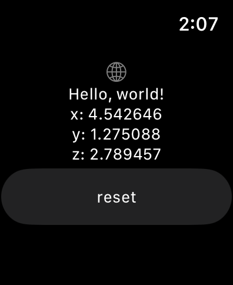

<!--
 * @Author: Frank Chu
 * @Date: 2023-03-12 22:55:42
 * @LastEditors: Frank Chu
 * @LastEditTime: 2023-03-20 02:11:41
 * @FilePath: /FallDetection/README.md
 * @Description: 
 * 
 * Copyright (c) 2023 by ${git_name}, All Rights Reserved. 
-->
# Fall Detection

## Apple Watch 上的速度计和陀螺仪传感器，完善基于速度计和陀螺仪的简单应用

### Markov Model

Markov模型是指一类随机过程模型，其假设未来状态只取决于当前状态，而与过去状态无关。因此，Markov模型也被称为“无记忆模型”。

Markov模型由一组状态和状态间的转移概率构成。在一个时刻，模型处于某一状态，随着时间的推移，模型按照一定的转移概率从当前状态转移到另一个状态。这样的转移构成了一条状态序列，也称为“马尔可夫链”。

### Acceleration



加速度数据使用加速度计收集，加速度计是一种测量加速度力的传感器，例如移动设备时经历的力。 x、y和z分量可能表示相应方向上的加速度力。

```txt
-17,1.19644412,0.01129969,1.17074617,0.24638238
2,1.26670515,-0.01744083,1.24517673,0.23188929
14,1.21680041,-0.10194286,1.18966086,0.23434575
30,1.10295341,-0.11054045,1.07740090,0.20855298
48,1.00128372,-0.02702100,0.99044241,0.14443952
62,0.95914589,0.09138010,0.95212172,0.07123718
73,0.88823455,0.22132654,0.86000468,0.01916034
86,0.93481543,0.31909343,0.87793680,-0.03586423
98,0.97431172,0.27414031,0.93247009,-0.06804379
114,1.08678443,0.22746768,1.06020572,-0.07295670
134,1.29885574,0.18079504,1.28079532,-0.11790981
154,1.26271041,0.17244310,1.25008964,-0.04446182
166,1.13810162,0.13608757,1.12947773,-0.03217955
187,1.05953556,0.09506479,1.05308200,-0.06779814
210,1.02504004,0.06632427,1.01721777,-0.10759270
223,1.00481498,0.07000895,0.99707484,-0.10292544
238,0.97090474,0.06263959,0.96415835,-0.09555608
250,0.93848743,0.06337652,0.92976799,-0.11078609
258,0.91995306,0.05797232,0.91036200,-0.11913804
275,0.96208729,0.05797232,0.95064785,-0.13608757
292,1.00225681,0.07565880,0.98675773,-0.15844131
315,1.01298404,0.04765522,1.00125081,-0.14615904
331,1.00852445,0.03537294,0.99977694,-0.12773563
350,0.99698161,0.00982582,0.98945983,-0.12184014
370,0.92730779,-0.02530148,0.92092475,-0.10562754
396,0.88155509,-0.04667263,0.87425212,-0.10317108
407,0.87885200,-0.01891470,0.87056744,-0.11889239
419,0.94281513,0.05625281,0.92706589,-0.16212599
434,1.01652672,0.09874947,0.99019677,-0.20757040
451,1.09408521,0.12847256,1.06094265,-0.23434575
464,1.12087131,0.14935243,1.08845494,-0.22206348
480,1.08090285,0.15770437,1.05701233,-0.16188034
491,1.02237378,0.14296565,1.00640937,-0.10931222
502,0.98763853,0.12331401,0.97373852,-0.10980351
523,0.97581998,0.10415367,0.96096496,-0.13387676
544,0.98272625,0.10046898,0.96268448,-0.16998664
564,1.00799914,0.09678430,0.98405563,-0.19577942
581,1.08430412,0.11840110,1.06855766,-0.14100048
599,1.13500065,0.12405095,1.12382789,-0.09924076
614,1.20179796,0.14959807,1.19113474,-0.05600716
628,1.29903452,0.22353735,1.27539112,0.10439931
646,1.45826482,0.22673074,1.39428352,0.36208138
659,1.45977346,0.02652971,1.38347512,0.46500682
674,1.27248667,-0.05625281,1.22527945,0.33874506
680,0.97675225,0.22697639,0.93197880,0.18423408
683,1.00408997,0.31442616,0.92927670,0.21395718
691,0.99526908,0.33186699,0.90471215,0.24883883
696,0.93132872,0.29747663,0.83150981,0.29575711
712,0.92694872,0.21371153,0.81652544,0.38320689
731,1.00021891,0.08179993,0.87744551,0.47311312
749,1.12744912,-0.07369363,1.01820035,0.47851732
762,1.30351807,-0.21862444,1.20882121,0.43602066
781,1.29502594,-0.23925866,1.20489088,0.40998224
798,1.05038277,-0.10415367,0.96587787,0.39941948
823,0.97655692,0.07565880,0.89660585,0.37952220
834,0.92063156,0.14591339,0.82438610,0.38296124
846,0.92040137,0.17440826,0.80055849,0.41931677
876,0.95197205,0.17760165,0.85533742,0.37829398
882,0.95425767,-0.09457349,0.92018782,0.23434575
886,0.98119273,-0.09604737,0.93713735,0.27438596
890,0.68496675,-0.06951766,0.64138024,0.23016978
904,0.53218737,-0.02702100,0.48048248,0.22722203
912,0.41849289,-0.08032606,0.37067897,0.17686472
935,0.41144042,-0.17219745,0.36871380,0.06067442
945,0.37359126,-0.16826713,0.33309522,0.01744083
```


## March 6, March 12 Apple Watch 速度计和陀螺仪数据采集

为了更好地理解 Apple Watch 上的速度计和陀螺仪传感器的工作原理，我阅读了 Apple 官方文档和一些示例代码。

### Speedometer

Apple Watch 上的速度计传感器可以测量手腕的加速度和旋转速度，从而计算出当前的速度和方向。速度计传感器的工作原理与 iPhone 上的加速度计类似，都是通过测量物体的加速度来计算速度。

在 Swift 中，可以使用 Core Motion 框架来访问速度计传感器。

```swift
// 创建一个 CMMotionManager 实例
let motionManager = CMMotionManager()

// 检查速度计是否可用
if motionManager.isAccelerometerAvailable {
    // 设置采样间隔
    motionManager.accelerometerUpdateInterval = 0.1

    // 开始采集数据
    motionManager.startAccelerometerUpdates(to: .main) { (data, error) in
        guard let data = data else { return }
        // 处理采集到的数据
        let x = data.acceleration.x
        let y = data.acceleration.y
        let z = data.acceleration.z
        let speed = sqrt(x * x + y * y + z * z)
        print("Current speed: \(speed)")
    }
}
```

### Gyroscope 陀螺仪

Apple Watch 上的陀螺仪传感器可以测量手腕的旋转速度和方向，从而计算出当前的姿态。陀螺仪传感器的工作原理与 iPhone 上的陀螺仪类似，都是通过测量物体的旋转速度和方向来计算姿态。

在 Swift 中，可以使用 Core Motion 框架来访问陀螺仪传感器。

```swift
// 创建一个 CMMotionManager 实例
let motionManager = CMMotionManager()

// 检查陀螺仪是否可用
if motionManager.isGyroAvailable {
    // 设置采样间隔
    motionManager.gyroUpdateInterval = 0.1

    // 开始采集数据
    motionManager.startGyroUpdates(to: .main) { (data, error) in
        guard let data = data else { return }
        // 处理采集到的数据
        let x = data.rotationRate.x
        let y = data.rotationRate.y
        let z = data.rotationRate.z
        print("Rotation rate: (\(x), \(y), \(z))")
    }
}
```

### Misc

除了上述基本的使用方法之外，还有一些其他的技术点值得注意：

#### 数据滤波

由于速度计和陀螺仪传感器采集到的数据可能存在一定的误差和噪音，因此在实际应用中通常需要对数据进行滤波，以提高数据的精度和可靠性。常用的滤波算法包括卡尔曼滤波、加权平均滤波等。

#### 坐标系和旋转矩阵

速度计和陀螺仪传感器采集到的数据通常是以设备坐标系为基准的，而实际应用中需要将数据转换为其他坐标系（例如地球坐标系），以满足具体需求。在进行坐标系转换时，需要使用旋转矩阵等数学工具。

#### 能耗优化

在实际应用中，为了降低能耗，通常需要对数据采集的频率和精度进行调整，以避免不必要的能耗浪费。另外，也可以使用 Core Motion 框架提供的一些优化功能，例如停止数据采集、降低采集频率等。

通过进一步学习和实践，我希望能够深入理解和掌握 Apple Watch 上的速度计和陀螺仪传感器的工作原理和应用技巧，为开发高质量的 Apple Watch 应用程序做出贡献。
